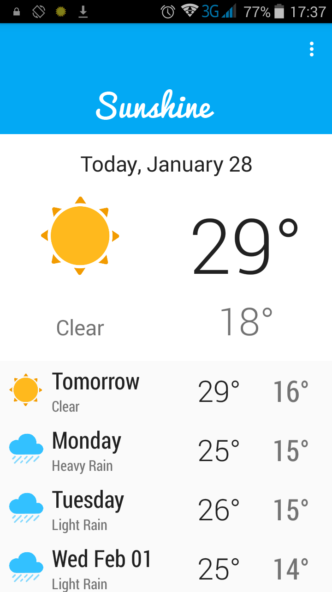
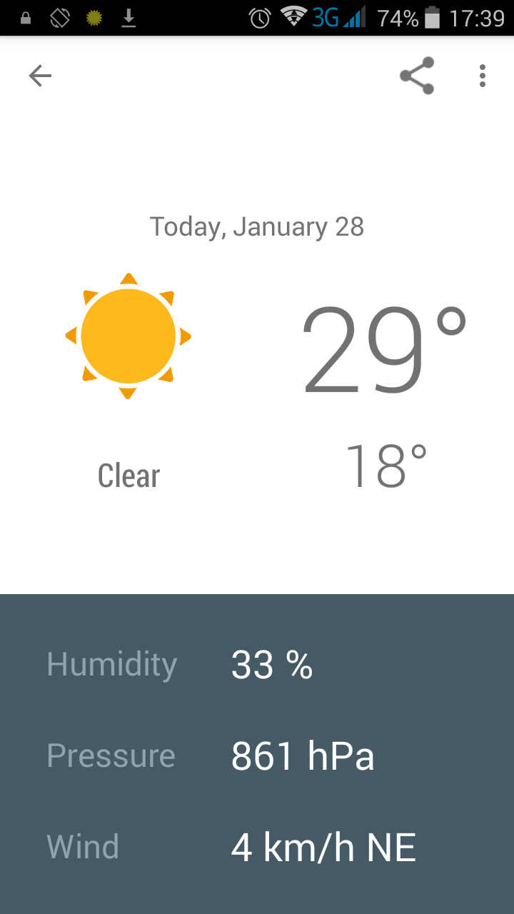
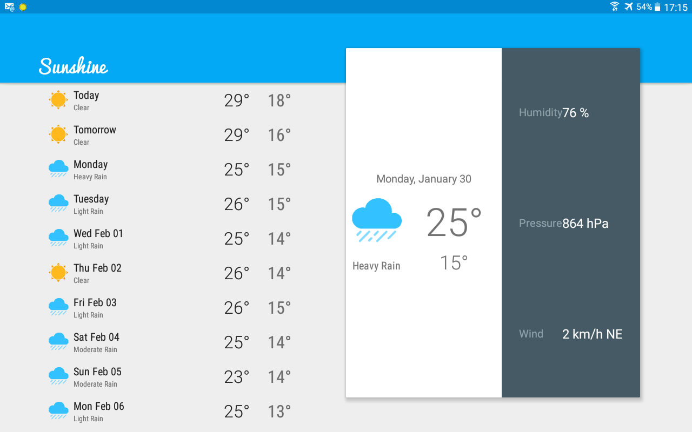

# Sunshine Advanced

## Version History :package:

**latest** 	Nothing here yet. :grin:

This repo tries its best to follow the [Semantic Versioning](http://semver.org/) guidelines.

## Introduction :point_up:

This repository holds an implementation of the Sunshine app created during [Udacity](udacity.com)'s [Advanced Android App Development](https://www.udacity.com/course/advanced-android-app-development--ud855) online class.

The app fetches weather from the net and shows it on phone or tab.

## How To Use :wrench:

:zero: Install the app and run it. :smile:

:one: Here is how the app looks on phone.

**Phones: The Home Screen**

 

**Phones: The Details Screen**

 

:two: And here is how it looks on (10-inch) tablets.

**(10-inch) Tabs: The Home and Details Screens**

 

## How It Works

This section will be updated in time (from today Saturday, 28. January 2017 05:39PM).

## Abilities :muscle:

* Fetches weather data online (specifically from [OpenWeatherMap](openweathermap.com)), stores it in phone memory, and displays it to the user.
* Allows the user to change his/her location to see the location's weather.

## Limitations :worried:

* The app does not provide hourly updates of weather. 
* The app cannot take a selfie (he he).

## Possible Future Work :fast_forward:

- [ ] Improve UI in 7-inch tabs.

- [ ] Improve the naming of days in the home screen.

## Other things :books:

* Much gratitude to the patient people at Udacity. Couldn't have learnt a thing without them. 

* Thanks to OpenWeatherMap for a robust weather API.

## License :lock_with_ink_pen:

```
Copyright 2017 Joshua Kairu

Licensed under the Apache License, Version 2.0 (the "License");
you may not use this file except in compliance with the License.
You may obtain a copy of the License at

    http://www.apache.org/licenses/LICENSE-2.0

Unless required by applicable law or agreed to in writing, software
distributed under the License is distributed on an "AS IS" BASIS,
WITHOUT WARRANTIES OR CONDITIONS OF ANY KIND, either express or implied.
See the License for the specific language governing permissions and
limitations under the License.
```