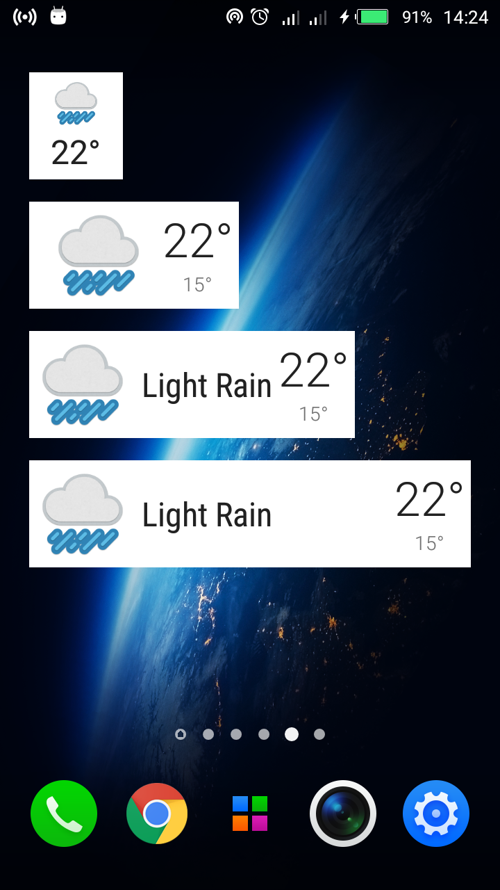

# Sunshine

## Introduction :point_up:

This repository holds an implementation of the Sunshine app created during [Udacity](udacity.com)'s [Advanced Android App Development](https://www.udacity.com/course/advanced-android-app-development--ud855) online class.

The app fetches weather from the net and shows it on an Android phone or tablet. The weather data is gotten from [openweathermap.com](http://openweathermap.com/)'s weather API.

## How To Use :wrench:

:zero: Install the app and run it. :smile:

It should work out of the box on devices running Android 5 and below.

# If you are using Android 6.0 Marshmallow and later the app will not work due to permissions unless you do this:

1. Install the app

1. Go to `Settings` -> `Apps` -> `Sunshine` -> `Permissions`

1. Give Sunshine the `Contacts` permission. This will allow the app to create a sync account so that it can sync weather data from the net

:recycle: This is yet to be tested using an internet connection

:one: Here is how the app looks on phone. This screen shows the weather for today and the next 13 or so days.

 

Tapping on a weather forecast for a particular day gets you to the details screen, which looks like this:

 

A tap on the menu button shows the following menu:


The `View Location` option lets you see the app's chosen location in the [Google Maps](https://maps.google.com/) app, if it's installed, and, in Android 6.0 and later, if you've given Sunshine the `Location` permission. The steps to grant the `Location` permission are similar to those used to grant the `Contacts` permission.

The `Settings` option leads to :point_down:


Here, one can:

* Change location, either by entering a location by hand or by tapping the location icon on the right to use the [Google Maps Place Picker](https://developers.google.com/places/android-api/placepicker)
* Choose between metric and imperial units for temperature
* Opt in or out of notifications every time the weather is updated
* Choose between colored and monochrome weather icon packs

:two: This is how the app looks on (10-inch) tablets. Home and details are fused into one to make the most of the larger screensize.


:three: Sunshine has two widgets, one to show today's weather and another to show the 14-day forecast.

Here is how today's weather widget - named **Sunshine Today** - looks like:



The widget can be resized horizontally, as the screenie shows.

The 14-day forecast widget, called **Sunshine Details** has the following appearance:


Sunshine can connect with [Muzei], if installed, to change your wallpaper based on the day's weather. Please visit [here] to learn more about how to install [Muzei].

## How It Works

Sunshine works this way:

1. Fetch weather JSON from openweathermap.com using a [Sync Adapter](https://developer.android.com/training/sync-adapters/index.html). This involves creating an [Account] that we will use for syncing and then calling the sync method [onPerformSync] at given intervals

1. Store fetched data in a SQLite database. There are two tables: `Location`, which - surprise, surprise - contains location data such as latitude and longitude; and `Weather`, which - as you may have figured by now - holds weather info such as temperature, humidity, and date. More info in the [database contract](app/src/main/java/com/joslittho/sunshine/data/contract/WeatherContract.java), [database helper](app/src/main/java/com/joslittho/sunshine/data/WeatherDbHelper.java), and [custom content provider](app/src/main/java/com/joslittho/sunshine/data/WeatherProvider.java) classes. Also, remove any data older than 24 hours to save space.

1. Display weather data to the user in a list and on widgets.

1. Update [Muzei].

1. If necessary, send the user a notification of the latest weather.

1. :recycle: There are statuses checked to ensure the app fails gracefully in unpleasant situations. A `status.md` will be written soon about this.

## Abilities :muscle:

* Fetches weather data online (specifically from [OpenWeatherMap](openweathermap.com)), stores it in phone memory, and displays it to the user.
* Allows the user to change his/her location to see the location's weather.

## Limitations :worried:

* The app does not provide hourly updates of weather. 
* The app cannot take a selfie (he he).

## Possible Future Work :fast_forward:

- [ ] Improve UI in 7-inch tabs.

- [ ] Improve the naming of days in the home screen.

## Other things :books:

* Much gratitude to the patient people at Udacity. Couldn't have learnt a thing without them. 

* Thanks to OpenWeatherMap for a robust weather API.

## License :lock_with_ink_pen:

```
Copyright 2017 Joshua Kairu

Licensed under the Apache License, Version 2.0 (the "License");
you may not use this file except in compliance with the License.
You may obtain a copy of the License at

    http://www.apache.org/licenses/LICENSE-2.0

Unless required by applicable law or agreed to in writing, software
distributed under the License is distributed on an "AS IS" BASIS,
WITHOUT WARRANTIES OR CONDITIONS OF ANY KIND, either express or implied.
See the License for the specific language governing permissions and
limitations under the License.
```
